# mem-con

Shared context service for any team, org, or project. Structured memory that travels
with you across AI tools, clients, and codebases.

## What It Is



A git repo of structured memory files organized by team and area. Any AI coding agent
loads this context at session start to assist work grounded in real project history,
decisions, and team knowledge.

Works with: Claude Code, Claude Desktop, Cursor, VS Code, JetBrains, Codex, Gemini CLI, Windsurf, Antigravity.

## Quick Start — Team Admin (first-time setup)

Clone this template, then run one script that forks it to your account or org,
configures `team.yaml`, and pushes your private copy:

```bash
git clone https://github.com/your-org/mem-con.git ~/.memcon
cd ~/.memcon
bash scripts/fork-and-setup.sh
```

The script will:
1. Fork the repo to your GitHub account or org (uses `gh` CLI)
2. Re-point `origin` to your fork; keep `template` remote for future upstream pulls
3. Prompt for your org name and patch `team.yaml`
4. Run `scaffold.sh` to generate your `memory/` structure
5. Push the configured fork and walk you through `init-user.sh`

At the end it prints the install command to share with your team.

**Requirements:** [`gh` CLI](https://cli.github.com) installed and authenticated (`gh auth login`).

## Quick Start — New Team Member

```bash
git clone {your_fork_url} ~/.memcon
bash ~/.memcon/install.sh
```

Installs hooks and runs configure-sources to set up your `user-profile.yaml`.

## Using as a Submodule

```bash
git submodule add {team_repo} .context
```

Add to your `CLAUDE.md`:
```
See .context/memory/shared/ for org-wide context.
See .context/memory/{team}/{area}/ for team area context.
```

## Switching Contexts

```bash
echo "eng-backend" > .memcon-context
```

Or let the agent ask at session start if `.memcon-context` is missing.

## Platform Support

| Tool | Config file | Notes |
|------|------------|-------|
| Claude Code | `CLAUDE.md` | Loaded automatically |
| Codex / Claude.ai | `AGENTS.md` | Full workflow inlined |
| Gemini CLI | `GEMINI.md` | Loaded automatically |
| Cursor | `.cursor/rules/mem-con.mdc` | alwaysApply: true |
| GitHub Copilot | `.github/copilot-instructions.md` | Loaded by Copilot Chat |
| Windsurf | `.windsurfrules` | Loaded from repo root |

## Contributing

PRs to `memory/{team}/{area}/` are auto-routed via CODEOWNERS.
See `docs/onboarding.md` for the contribution workflow.
